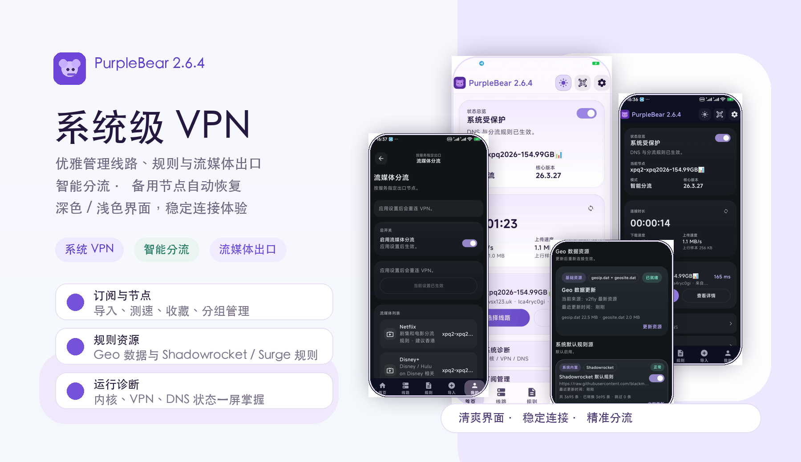

# PurpleBear

PurpleBear 是一款 Android 网络代理与线路管理工具，基于系统 VPN 能力接入 Xray 内核，面向需要管理订阅节点、手动节点、分流规则、分应用代理和流媒体独立出口的用户。

本仓库顶层就是 PurpleBear Android 工程。打开仓库即可直接看到 `app/`、`gradle/`、`build.gradle.kts`、`settings.gradle.kts` 和 Gradle Wrapper，不需要再进入额外的工程子目录。

本仓库只包含 PurpleBear Android 应用本身的项目代码、资源、构建配置和必要的运行时依赖，不包含 Xray-core 的完整源码。

## 主要功能

### 系统 VPN 连接

- 使用 Android `VpnService` 建立系统级 VPN 隧道。
- 支持一键连接、断开、切换线路。
- 支持显示当前连接状态、当前线路、运行时长、上下行速率和流量样本。
- 支持在连接中切换节点，应用会处理重连与状态同步。
- 支持系统通知栏展示 VPN 运行状态。
- 支持 Android 快捷设置磁贴，从系统下拉菜单快速连接或断开。

### 节点与订阅管理

- 支持导入 `http` / `https` 节点订阅。
- 支持导入本地单节点链接。
- 支持扫码导入订阅或节点。
- 支持从文件导入订阅内容。
- 支持订阅分组和 Local 本地分组。
- 支持订阅刷新、手动同步、每日自动更新。
- 支持同来源节点去重与覆盖更新。
- 支持节点收藏。
- 支持节点删除、订阅组删除。
- 支持查看节点详情，包括协议、传输层、安全层、地址、端口和原始链接信息。
- 支持节点延迟测试，并在列表中展示延迟和稳定状态。
- 支持隐藏当前暂不支持的节点类型，避免用户误选。

### 支持的节点类型

PurpleBear 的导入解析器目前支持以下常见分享格式：

- VLESS
- VMess
- Trojan
- Shadowsocks
- SOCKS
- HTTP
- Hysteria2

实际可用性取决于当前内核能力、节点参数、服务端配置和设备网络环境。

### 手动创建本地节点

- 支持在应用内新建 Local 节点。
- 支持编辑节点名称、地址、端口、协议、安全层和传输参数。
- 支持配置 TLS / REALITY 等安全层字段。
- 支持 WebSocket、gRPC、mKCP、HTTP Upgrade 等传输相关参数。
- 支持保存为本地节点并直接用于连接。

### 备用节点与自动恢复

- 支持为节点配置备用节点。
- 主节点连接失败后，可自动切换到备用节点。
- 备用节点运行期间，服务层会持续检测主节点。
- 主节点连续恢复稳定后，可自动切回主节点。
- 备用节点逻辑运行在 VPN 服务层，不依赖应用界面常驻前台。
- 支持断线自动重连，降低临时网络波动对连接的影响。

### 前置节点

- 支持为节点配置前置节点。
- 可用于需要链式出口或特殊入口线路的场景。
- 节点列表会标记前置 / 备用配置，便于快速识别。

### 分流规则

- 内置 Geo 数据资源状态展示。
- 支持更新 `geoip.dat` 和 `geosite.dat`。
- 支持系统默认规则源。
- 支持添加自定义规则源。
- 支持 Shadowrocket / Surge 文本规则。
- 支持规则源启用 / 禁用。
- 支持规则源更新状态、转换数量、跳过数量和错误信息展示。
- 支持规则详情查看，便于确认规则来源和转换结果。
- 支持智能分流、全局代理、分应用代理三种模式。

### 分应用代理

- 支持选择哪些应用进入 VPN。
- 支持搜索应用名称或分类。
- 支持在智能分流和仅代理选中应用之间切换。
- 应用名单变更后会触发连接配置更新。

### 流媒体分流

- 支持为常见流媒体服务单独指定出口节点。
- 支持一键刷新流媒体规则。
- 支持按服务选择默认线路或独立节点。
- 已内置 Netflix、Disney+、YouTube、YouTube Music、Prime Video、Hulu、Max、HBO、Spotify、Apple TV、Apple Music、Bahamut、AbemaTV、BiliBili、ViuTV、DAZN、Paramount+、Peacock 等服务规则入口。
- 流媒体规则会被转换为 Xray 路由规则，并在连接配置中生效。

### DNS 与高级设置

- 支持系统 DNS、远程 DNS、自定义 DNS 模式。
- 支持设置日志级别：error、warning、info、debug。
- 支持核心资产状态查看。
- 支持启动后自动连接。
- 支持恢复上次连接线路。
- 支持断线自动重连。
- 支持备用节点心跳间隔设置。
- 支持浅色 / 深色主题。

### 诊断与日志

- 支持系统诊断，检查配置、内核、VPN、DNS 和握手状态。
- 支持复制诊断摘要。
- 支持查看最新运行日志。
- 支持 Xray 错误日志和访问日志。
- 日志写入和裁剪在后台执行，减少连接阶段卡顿。

### 订阅与资源同步

- 支持节点订阅与规则资源统一同步。
- 支持非计费网络下每日自动更新。
- 支持同步完成通知。
- 支持对一次性快照订阅做静态导入处理，避免后续刷新失败造成误判。

### 界面体验

- 使用 Jetpack Compose 构建原生 Android 界面。
- 首页展示连接状态、速率、时长、当前线路和常用入口。
- 线路页面按分组展示节点，支持收藏、测速、详情、删除和快速切换。
- 线路列表采用更扁平、清爽的节点展示方式，减少多层卡片嵌套。
- 支持浅色模式下更清晰的未选中 / 选中节点区分。

## 隐私与数据

- PurpleBear 不内置任何订阅账号、机场服务或代理服务器。
- 用户导入的订阅、节点、规则和偏好设置保存在本机。
- 应用会在用户主动同步订阅、规则或 Geo 数据时访问对应 URL。
- VPN 功能需要 Android 系统 VPN 授权。
- 分应用代理需要读取本机应用列表用于选择代理范围。
- 隐私政策页面位于 `privacy-policy.html`，GitHub Pages 开启后可通过项目 Pages 地址访问。

## 项目结构

- `app/`：Android 应用模块，包含 Kotlin 源码、Compose UI、资源、Manifest、预编译运行依赖和 Geo 数据。
- `gradle/`：Gradle Wrapper 文件。
- `build.gradle.kts`、`settings.gradle.kts`、`gradle.properties`：顶层 Gradle 配置。
- `gradlew`、`gradlew.bat`：命令行构建入口。
- `index.html`、`privacy-policy.html`：GitHub Pages 使用的项目页面与隐私政策。

不再跟踪的内容包括外部内核源码、第三方示例工程、UI 原型草稿、临时构建目录、签名文件、本地配置和未使用的大体积库文件。

## 构建环境

- Android Studio Hedgehog 或更新版本
- JDK 17
- Android SDK 35
- Gradle Wrapper 已包含在仓库中
- 当前发布包仅面向 `arm64-v8a`

命令行构建：

```bash
./gradlew :app:assembleRelease
```

生成的 APK 位于：

```text
app/build/outputs/apk/release/app-release.apk
```

如果本地没有发布签名配置，Release 构建可能无法签名。开发调试可使用：

```bash
./gradlew :app:assembleDebug
```

## 版本 0.6.5 更新

1. 新增自定义文本规则，可手动编写 Shadowrocket / Surge 规则。

2. 支持规则按策略分流，可指定直连、代理、拒绝，或选择指定节点。

3. 新增节点选择弹窗，支持搜索节点；订阅刷新后节点名称变化也会尽量自动匹配。

4. 优化规则校验，保存时会提示格式错误，并在文本框中标红错误行。

5. 新增规则输入自动补全，减少手动输入成本。

6. 优化自定义规则界面，文本规则和 URL 规则分开展示。

7. 提升自定义规则优先级，用户规则会优先生效。

8. 兼容 `no-resolve`、`GEOIP`、`URL-REGEX` 等更多规则写法。

9. 修复添加规则菜单定位异常、版本显示不一致等问题。

10. 优化规则解析与节点匹配稳定性，降低订阅更新后的失效概率。

## 版本 2.6.4 更新

1. 优化线路页面视觉层级，节点组和节点列表更清爽，减少多层圆角卡片嵌套感。

2. 调整节点展示样式，移除大面积渐变和铺色背景，亮色模式下未选中节点使用接近白色的平底，选中节点使用轻微强调色，更容易识别当前线路。

3. 优化备用节点机制：主节点连接失败后可自动切换到备用节点；主节点恢复稳定后，可自动回到主节点。

4. 将备用节点检测逻辑下移到 VPN 服务层，应用退到后台或界面被回收后，备用节点切换仍能继续工作。

5. 修复自动重连与备用节点切换可能同时触发的问题，降低连接状态混乱的概率。

6. 修复启动时自动连接状态判断过早结束的问题，提升首次启动、引导流程后的自动连接可靠性。

7. 优化节点心跳与延迟显示逻辑，避免心跳刷新频繁打乱节点列表展示。

8. 优化快捷开关响应速度，减少节点较多时点击系统快捷开关可能卡顿的问题。

9. 修复 Android 14+ 前台服务类型处理问题，提升真机和上架测试稳定性。

10. 优化连接初始化流程，降低快速重连、备用节点切换时出现保护失败的概率。

11. 优化日志写入与裁剪流程，减少连接阶段高频日志对性能的影响。

## 内核与鸣谢

PurpleBear 使用 Xray 作为代理核心能力来源。Xray-core 是一个独立开源项目，完整源码请访问：

https://github.com/XTLS/Xray-core

感谢 Xray-core 项目及其贡献者提供核心网络代理能力；感谢 v2fly GeoIP / GeoSite 数据、blackmatrix7 规则项目以及 Android、Kotlin、Jetpack Compose 生态为本项目提供基础能力。
